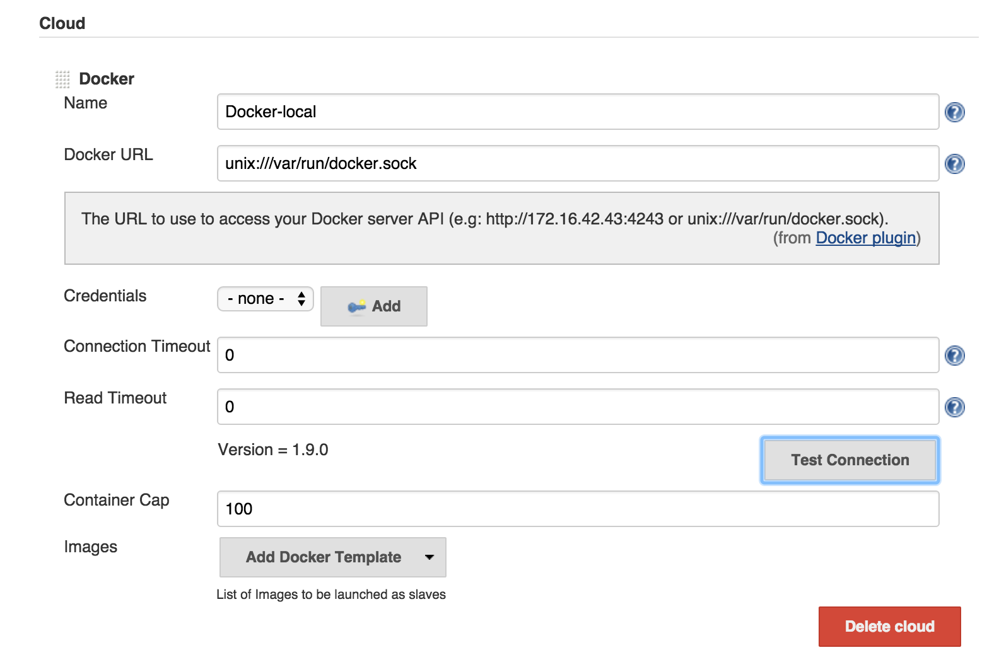

# Dockerized Jenkins Slaves

I'm running Docker on MacOS. This means the I have `docker-machine` running. I wanted to run Jenkins in a Docker container and eventually I'd like to run Jenkins slaves as Docker containers too. This makes these Docker container 'siblings'.

Credit goes to this writeup for helping me work past some painful hurdles. It can be found [here:](
http://container-solutions.com/running-docker-in-jenkins-in-docker/)

## Run Jenkins in a Docker container 

 1. Add any plugins you need to the `plugins.txt' file.
 1. Build the container `make build`
 1. Start the container `make start`
 1. Configure Jenkins. Goto `http://{your docker-machine ip or localhost}:8080/configure`
    Update the 'Cloud' settings according to the image below.

